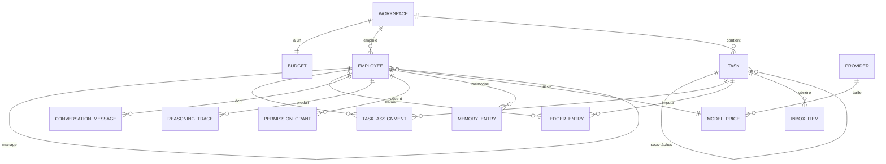
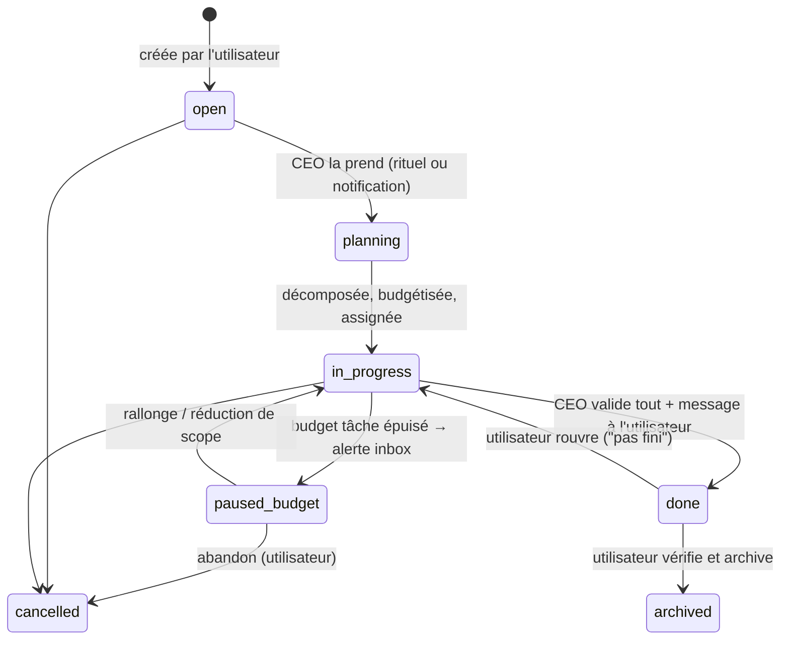
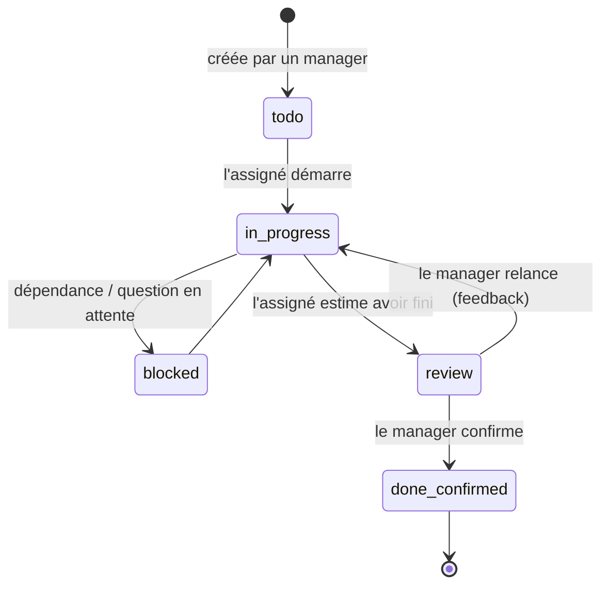

# KoaTeam — Spécification produit V1

> Document de référence pour le développement du MVP.
> Issu du brainstorming (voir `BRAINSTORMING.md`, 25 décisions actées).
> Statut : **brouillon v0.1** — les choix marqués 🔶 sont des arbitrages faits par la spec, à challenger avant le premier commit de code.

---

## 1. Résumé

KoaTeam est une application desktop (macOS d'abord, Windows/Linux ensuite) qui transforme chaque projet en **entreprise virtuelle autonome** tournant sur la machine de l'utilisateur, 24h/24 :

- Un **workspace** = une entreprise, fondée via un **cabinet de recrutement** en roleplay qui aide à embaucher un **CEO** (profils, jauges de caractère).
- Le CEO reçoit une **mission**, un **budget périodique** et une liste de **providers IA autorisés** ; c'est lui qui crée les départements et **embauche** les agents, en arbitrant coût réel vs budget.
- L'utilisateur pilote via une **todo-list** : le CEO décompose les tâches, les budgétise, les assigne ; la hiérarchie supervise, filtre les questions et fait remonter les livrables.
- **Rituels** : ronde technique gratuite du démon + ronde managériale LLM en cascade quand il y a de l'activité ; rapport matinal du CEO.
- **Tout est auditable** : conversations inter-agents, raisonnements internes, comptabilité au dollar près.
- Contrainte système : **< 200 Mo de RAM au repos**, fonctionnement 24/7 sans dérive (workers éphémères).

### Non-objectifs V1

Multi-workspaces simultanément actifs, marketplace de rôles, app mobile, automatisation AppleScript/COM poussée, distribution Windows/Linux (les builds doivent compiler, pas être distribués), sync cloud, multi-utilisateurs.

---

## 2. Glossaire

| Terme | Définition |
|---|---|
| **Workspace** | Un projet = une entreprise virtuelle : son CEO, son organigramme, ses tâches, son budget, sa comptabilité, sa base de données. |
| **Employé / Agent** | Entité IA avec identité (prénom, titre, avatar, caractère), fiche de poste, modèle IA attribué, permissions, mémoire, contrat. |
| **CEO** | Employé racine du workspace. Seul interlocuteur "stratégique" de l'utilisateur. Recrute, budgétise, décompose, rapporte. |
| **HEAD** | Manager d'un département. Rapporte au CEO, supervise ses équipes, filtre les questions. |
| **Spécialiste** | Employé en contrat de mission (CDD), scope très étroit, rapporte à un manager. |
| **Cabinet de recrutement** | Agent système (hors organigramme) qui gère la fondation d'un workspace et le remplacement du CEO. |
| **Tâche** | Objet central : créée par l'utilisateur, budgétisée et décomposée par le CEO en arbre de sous-tâches. |
| **Sous-tâche** | Nœud de l'arbre d'une tâche, assigné à un employé, supervisé par son manager. |
| **Rituel** | Événement planifié : ronde technique (démon, gratuite), ronde managériale (LLM), rapport matinal. |
| **Inbox** | File des éléments qui requièrent l'utilisateur : questions filtrées, demandes, livrables, alertes. |
| **Intervention** | Une exécution d'un agent = un processus worker éphémère (réveil → travail → rapport → mort). |
| **Écriture comptable** | Mouvement budgétaire : consommation API, engagement (allocation à une tâche), restitution. |

---

## 3. Modèle de données

Une base **SQLite par workspace** + une base "app" globale (réglages, providers, tarifs, liste des workspaces). 🔶

### 3.1 Diagramme d'ensemble

### 3.2 Entités

#### Workspace
| Champ | Type | Notes |
|---|---|---|
| id, name, created_at | | |
| mission | text | Mission donnée au CEO |
| status | enum | `active`, `paused`, `archived` |
| budget_amount | decimal $ | Enveloppe de la période |
| budget_period | enum | `daily`, `weekly`, `monthly`, `yearly` |
| budget_period_start | date | Ancrage de la période courante |
| allowed_providers | ref[] | Providers/modèles autorisés (sous-ensemble de la table globale) |
| ritual_tick_minutes | int | Défaut 60 🔶 |
| morning_report_time | time | Défaut 09:00 🔶 |
| working_language | text | Langue de travail des agents (défaut : langue de l'utilisateur) 🔶 |

#### Employee
| Champ | Type | Notes |
|---|---|---|
| id, workspace_id, created_at | | |
| first_name, title, avatar | | Avatar : généré (style cohérent) 🔶 |
| role | enum | `ceo`, `head`, `specialist` |
| department | text | Nom du département (le CEO en crée librement) |
| manager_id | ref | null pour le CEO (rapporte à l'utilisateur) |
| contract | enum | `permanent` (CEO, HEADs), `mission` (spécialistes) |
| status | enum | `active`, `archived` (réveillable) |
| character | json | Jauges 0–100 : `challenge`, `risk_aversion`, `rigor`, `verbosity`, `formality`, `budget_tightness`… extensible |
| system_prompt | text | Fiche de poste générée à l'embauche (par le cabinet pour le CEO, par le recruteur sinon) |
| scope | text | Périmètre étroit, en clair (affiché sur la fiche) |
| model_ref | ref | Provider + modèle attribué à l'embauche |
| autonomy | enum | `ask_everything`, `ask_sensitive` (défaut), `act_and_log` 🔶 |
| mission_brief / mission_report | text | Pour les contrats `mission` : brief d'embauche, rapport de fin |

#### Task (tâche et sous-tâche = même table, arbre par `parent_id`)
| Champ | Type | Notes |
|---|---|---|
| id, workspace_id, parent_id, created_at | | `parent_id` null = tâche principale |
| title, description | | |
| objectives | text[] | Critères de réussite |
| priority | enum | `low`, `normal`, `high`, `urgent` |
| due_date | date? | Optionnelle |
| status | enum | Voir machines à états §4 |
| created_by | ref | Utilisateur (principale) ou employé (sous-tâche) |
| assignee_id | ref? | Un seul employé par sous-tâche 🔶 |
| supervisor_id | ref? | Le manager de l'assigné (dénormalisé au moment de l'assignation) |
| budget_allocated | decimal $ | Alloué par le CEO (principale) ou le manager délégant (sous-tâche, prélevé sur celui du parent) 🔶 |
| budget_spent | decimal $ | Somme des consommations imputées |
| complexity_note | text | L'évaluation du CEO (simple/complexe, % du projet) — affichée à l'utilisateur |
| deliverables | ref[] | Fichiers/notes produits |

#### LedgerEntry (comptabilité)
| Champ | Type | Notes |
|---|---|---|
| id, workspace_id, created_at | | |
| type | enum | `consumption` (appel API), `allocation` (engagement sur tâche), `release` (restitution du delta), `topup` (rallonge), `period_reset` |
| amount | decimal $ | Signe selon le type |
| employee_id, task_id | ref? | Imputation |
| detail | json | Pour `consumption` : provider, modèle, tokens in/out, prix unitaires appliqués |

Invariants : `disponible = budget_amount − Σconsumption − Σengagements_ouverts` ; l'engagement ouvert d'une tâche = `budget_allocated − budget_spent` ; à la clôture d'une tâche une écriture `release` restitue ce reliquat.

#### InboxItem
| Champ | Type | Notes |
|---|---|---|
| type | enum | `question` (filtrée par la hiérarchie), `permission_request`, `budget_topup_request`, `budget_pause_alert`, `deliverable_review` (tâche principale terminée), `morning_report`, `mission_report`, `info` |
| from_employee_id, task_id | ref? | Contexte |
| status | enum | `pending`, `answered`, `dismissed` |
| payload / response | json | Contenu + réponse de l'utilisateur |

#### ConversationMessage
Messages horodatés entre agents (et agent↔utilisateur) : `from_id`, `to_id` (employé, `user`, ou canal de département 🔶), `task_id?`, `content`. Toute communication inter-agents passe par ce canal persisté — c'est ce qui rend l'audit exhaustif.

#### ReasoningTrace
Une trace par intervention : `employee_id`, `task_id?`, `trigger` (rituel, assignation, question…), transcript complet de la boucle agentique (réflexion, appels d'outils, résultats), `tokens`, `cost`, `worker_exit` (ok/crash/timeout). Lisible depuis la vue Audit.

#### PermissionGrant
`employee_id`, `kind` (`fs_read`, `fs_write`, `shell`, `web_search`, `browser`, `mcp_server`), `scope` (chemin, domaine, nom du serveur MCP), `granted_by` (user), révocable. Les actions irréversibles (suppression hors zone, envoi externe, dépense) exigent **toujours** une approbation à l'acte, quel que soit le grant.

#### MemoryEntry
Mémoire persistante par employé : `employee_id`, `content`, `tags`, mise à jour par l'agent en fin d'intervention. Archivée (et restaurée) avec l'employé. Format V1 : notes markdown structurées, pas d'embeddings. 🔶

#### Provider / ModelPrice (base app globale)
`provider` (nom, type d'API, clé — stockée dans le trousseau système), `model` (nom, prix input/output par Mtoken, contexte max). Table **embarquée** dans l'app, mise à jour via les releases ; **overridable** et **extensible** dans les réglages (provider personnalisé = endpoint + clé + tarifs).

---

## 4. Machines à états

### 4.1 Tâche principale

À l'entrée dans `planning`, le CEO produit : l'évaluation (`complexity_note`), l'allocation budgétaire (écriture `allocation`), l'arbre de sous-tâches, et les embauches éventuelles. À `done` → `archived` ou `cancelled` : écriture `release` du reliquat.

### 4.2 Sous-tâche

L'assigné change librement `todo/in_progress/blocked/review` ; seuls `done_confirmed` (et la création de sous-tâches correctives) appartiennent au manager.

### 4.3 Employé

`active` ⇄ `archived`. Passage à `archived` (contrats `mission`, décidé par la hiérarchie) : l'agent rédige son `mission_report`, sa mémoire est gelée. Réveil : restauration à l'identique. Le CEO ne peut être archivé que via le flux "remplacement" (§5.6).

---

## 5. Flux détaillés

### 5.1 Fondation d'un workspace

1. L'utilisateur clique "Nouveau workspace" → conversation avec le **cabinet de recrutement** (agent système, modèle par défaut de l'app 🔶).
2. Le cabinet interroge : nature du projet, objectifs, contraintes, ton, langue de travail, dossiers de la machine concernés, budget envisagé et sa période, providers à autoriser.
3. Le cabinet propose **3 profils de CEO** (prénom, titre, pitch, pré-réglage des jauges). L'utilisateur en choisit un et **ajuste les jauges**.
4. Récapitulatif contractuel affiché (mission, budget/période, providers, permissions initiales) → validation → le workspace est créé, le CEO embauché.
5. **Première conversation avec le CEO** : il propose les départements et les HEADs à embaucher (avec coût estimé par recrue) ; l'utilisateur valide ; le CEO embauche.

### 5.2 Vie d'une tâche (le flux cœur)

1. L'utilisateur crée une tâche (titre, description, objectifs, priorité, échéance?).
2. Le démon notifie le CEO (intervention immédiate 🔶 — pas d'attente du rituel pour une nouvelle tâche).
3. Le CEO évalue : complexité, % du budget disponible, départements concernés. Il **alloue le budget** de la tâche, crée les sous-tâches, les assigne (en embauchant si besoin, dans la limite du disponible).
4. Les assignés travaillent (interventions éphémères) : chaque intervention consomme, impute (`consumption`), avance le statut, écrit dans les conversations et sa mémoire.
5. Questions : l'assigné demande à son manager → le manager répond s'il peut, sinon escalade (jusqu'au CEO, puis inbox utilisateur). Chaque échange est une conversation persistée.
6. Sous-tâche en `review` → le manager confirme, relance, ou crée des sous-tâches correctives.
7. Toutes les sous-tâches confirmées → le CEO contrôle le résultat global, passe la tâche à `done`, envoie le message "on a fini XYZ" + livrables (item `deliverable_review` en inbox).
8. L'utilisateur vérifie → archive (reliquat restitué) ou rouvre avec un commentaire (le CEO re-décompose ce qui manque).

### 5.3 Budget

- **Période** : à chaque début de période, écriture `period_reset` ; l'enveloppe repart à `budget_amount`. Les engagements ouverts des tâches en cours sont reconduits (ils continuent d'exister comptablement). 🔶
- **Garde-fou dur** : avant chaque appel API, le démon vérifie budget tâche ET budget workspace. Plafond tâche atteint → la tâche passe `paused_budget`, alerte inbox. Plafond workspace atteint → tout le workspace se met en pause + alerte. Le CEO peut demander une rallonge (`budget_topup_request`), l'utilisateur accorde/refuse depuis l'inbox.
- **Restitution** : clôture/abandon de tâche → `release` du reliquat vers le disponible du workspace.

### 5.4 Rituels

- **Tick** (défaut 60 min, paramétrable) — **ronde technique du démon, gratuite** :
  - workers vivants ? interventions plantées (crash/timeout) ? sous-tâches `in_progress` sans activité depuis N ticks 🔶 ? statuts incohérents ? budget proche du plafond (> 80 % 🔶) ?
  - **Rien d'actif et rien d'anormal → personne n'est réveillé, coût zéro.**
  - Sinon → **ronde managériale** : le CEO est réveillé avec le rapport technique ; il réveille les HEADs concernés ; chaque HEAD interroge ses équipes actives et consolide ; le CEO agrège. Relances, débloquages et corrections partent d'ici.
- **Rapport matinal** (défaut 09:00, paramétrable) : le CEO compile avancement / décisions / dépenses (consommé, engagé, disponible) / blocages → item `morning_report` en inbox + notification native.
- **À la demande** : tout ce qui requiert l'utilisateur part en inbox immédiatement, sans attendre un rituel.

### 5.5 Embauche par le CEO (ou un HEAD délégué 🔶 non — V1 : seul le CEO embauche)

1. Besoin identifié (fondation, décomposition, ronde) → le CEO définit la fiche de poste : scope étroit, département, manager, caractère adapté, **choix du modèle** sur la table des tarifs (coût vs compétence, justifié dans son raisonnement).
2. Création de l'employé, message de bienvenue/brief dans les conversations (auditable).
3. L'embauche n'a pas de coût fixe — le "salaire" est la consommation réelle. Le CEO raisonne en coût estimé par intervention selon le modèle choisi.

### 5.6 Fin de mission & remplacement du CEO

- **Fin de mission (spécialiste)** : le manager décide → l'agent rédige son rapport de mission → `archived`, mémoire gelée, item `mission_report` en inbox (informatif). Réveil possible depuis sa fiche.
- **Remplacement du CEO** : l'utilisateur rappelle le **cabinet de recrutement** → le CEO sortant rédige un rapport de passation 🔶 → nouveau processus de sélection (profils, jauges) → le nouveau CEO reçoit mission, budget, organigramme et passation. L'entreprise (employés, tâches, mémoires, comptabilité) survit intacte.

### 5.7 Permissions & approbations

1. Un agent tente une action non couverte par ses grants → l'intervention se met en attente 🔶 (ou contourne si possible), item `permission_request` en inbox.
2. L'utilisateur accorde (one-shot ou permanent → `PermissionGrant`) ou refuse.
3. Actions irréversibles (suppression hors zone de travail, envoi vers l'extérieur, dépense) : approbation à l'acte systématique, non désactivable en V1, même en autonomie `act_and_log`.
4. Zone de travail par défaut : chaque employé écrit dans `~/KoaTeam/<workspace>/<employé>/` 🔶 ; tout le reste passe par des grants.

---

## 6. Écrans (V1)

Navigation latérale par workspace : **Tâches · Organigramme · Inbox (badge) · Audit · Comptabilité · Réglages**. Fenêtre principale + icône barre de menu.

### 6.1 Accueil / Workspaces
Liste des workspaces (nom, mission, statut, dépense de la période). Actions : ouvrir, créer (→ cabinet de recrutement), mettre en pause, archiver. V1 : un seul workspace `active` à la fois 🔶.

### 6.2 Fondation (cabinet de recrutement)
Chat plein écran avec le cabinet. Panneau latéral qui se remplit au fil de l'interview (mission, budget, providers, départements pressentis). Étape profils : 3 cartes de CEO comparables + **jauges de caractère** interactives. Récapitulatif contractuel final avant signature.

### 6.3 Tâches (écran principal)
- **Todo-list** des tâches principales : titre, statut, avancement (x/y sous-tâches confirmées), budget (alloué/consommé, barre), badge questions en attente.
- **Vue détail** : description, objectifs, `complexity_note` du CEO, **arbre des sous-tâches** (assigné avec avatar, statut, coût), livrables, fil des Q/R liées, historique des écritures comptables de la tâche.
- Actions utilisateur : créer, prioriser, commenter, rallonger le budget, rouvrir une tâche `done`, archiver, annuler.

### 6.4 Organigramme
Arbre visuel : utilisateur → CEO → départements → HEADs → spécialistes. Carte par employé : avatar, prénom, titre, modèle IA (et coût/Mtoken), statut, dépense cumulée, tâches en cours. Les archivés apparaissent grisés dans une section "Anciens" (réveillables). Clic → **Fiche employé** : identité, jauges, scope, fiche de poste (prompt visible — transparence), permissions (révocables ici), mémoire consultable, historique d'interventions, rapport de mission le cas échéant.

### 6.5 Inbox
File unique triée par urgence : questions, demandes de permission (avec contexte : qui, pourquoi, quelle action exacte), demandes de rallonge, alertes de pause budgétaire, livrables à vérifier, rapports matinaux. Répondre/accorder/refuser sans quitter l'écran. Badge sur l'icône barre de menu + notifications natives.

### 6.6 Audit
Explorateur des **conversations** (par canal, par tâche, par employé, chronologique) et des **traces de raisonnement** (par intervention : déclencheur, transcript de la boucle, outils appelés, tokens, coût, issue). Recherche plein texte. C'est la fenêtre "ouvrir le capot".

### 6.7 Comptabilité
Tableau de bord : enveloppe / consommé / engagé / disponible de la période, burn-down, dépense par employé, par tâche, par modèle. Journal des écritures filtrable.

### 6.8 Réglages
- **Providers & tarifs** : table embarquée, override des prix, ajout d'un provider personnalisé (endpoint, clé → trousseau, tarifs). Clés testables ("vérifier la connexion").
- **Rituels** : fréquence du tick, heure du rapport matinal, seuils d'alerte budget.
- **Workspace** : mission, budget/période, providers autorisés, langue de travail.
- **Application** : démarrage au login, notifications, canal de mise à jour, seuil du watchdog mémoire.

---

## 7. Architecture d'exécution (rappel des contraintes)

Voir `BRAINSTORMING.md` §5 pour le détail. Points contractuels pour la spec :

- **3 étages** : UI Tauri v2 (jetable) / **démon Node** (24/7, minimal : scheduler, ronde technique, file d'interventions, comptabilité, permissions, inbox, watchdog) / **workers éphémères** (1 processus par intervention, tué à la fin ; Playwright à la demande).
- **IPC** 🔶 : UI ↔ démon via WebSocket localhost (port éphémère, token local) ; démon ↔ worker via stdio JSON-RPC. Le démon est la seule autorité d'écriture sur SQLite.
- **File d'interventions** : le démon sérialise les réveils (limite de workers concurrents paramétrable, défaut 2 🔶) — maîtrise du coût, de la RAM et des courses de données.
- **Chaque appel API passe par le démon** (proxy comptable) : vérification budget → appel → écriture `consumption`. Un worker ne détient jamais de clé API. 🔶
- **Budgets = contrainte pré-appel** ; le worker reçoit un budget d'intervention et s'arrête proprement s'il l'atteint.
- Objectifs mesurables : RAM au repos < 200 Mo (UI fermée) ; retour au niveau de repos après chaque intervention ; test d'endurance 48 h en CI ; redémarrage du démon sans perte (état 100 % SQLite).

---

## 8. Critères d'acceptation du MVP

Scénario de recette de bout en bout :

1. ✅ Créer un workspace via le cabinet : interview, 3 profils, jauges, contrat (mission, budget mensuel, 2 providers dont les tarifs diffèrent).
2. ✅ Le CEO propose 2 départements + HEADs avec justification des modèles choisis ; l'utilisateur valide ; l'organigramme les affiche.
3. ✅ Poser une tâche floue avec objectifs → le CEO produit évaluation + allocation + arbre de sous-tâches ; au moins une embauche de spécialiste CDD sur un modèle économique, justifiée par le coût.
4. ✅ Une sous-tâche utilise le shell → demande de permission en inbox → accord → exécution → trace complète en Audit.
5. ✅ Une question d'un spécialiste est résolue par son HEAD **sans** apparaître dans l'inbox utilisateur ; une question sans réponse hiérarchique y apparaît.
6. ✅ Réduire artificiellement le budget d'une tâche → pause propre + alerte → rallonge depuis l'inbox → reprise.
7. ✅ Ronde technique sans activité → zéro appel LLM (vérifiable en comptabilité). Avec activité → cascade CEO→HEAD→équipe visible en Audit.
8. ✅ Rapport matinal à l'heure configurée, avec chiffres comptables exacts (consommé/engagé/disponible).
9. ✅ Tâche terminée : passage `done` par le CEO + message ; réouverture par l'utilisateur → re-décomposition ; puis archivage → écriture `release` du reliquat.
10. ✅ Fin de mission d'un CDD : rapport de mission, archivage, puis réveil avec mémoire intacte.
11. ✅ RAM au repos < 200 Mo après 48 h de fonctionnement avec missions périodiques ; kill -9 du démon → redémarrage sans perte d'état.
12. ✅ `git tag` → CI produit les 3 builds (macOS signé/notarizé distribué ; Windows/Linux compilent) ; auto-update fonctionnel entre deux versions.

---

## 9. Jalons de développement proposés

| Jalon | Contenu | Sortie |
|---|---|---|
| **M0 — Spike** | Tauri v2 + sidecar Node empaqueté (3 OS) + 1 worker éphémère avec vraie boucle agentique multi-provider ; mesure RAM | GO/NO-GO sur la stack |
| **M1 — Socle** | Monorepo, CI 3 OS, démon (SQLite, IPC, file d'interventions, proxy comptable), modèle de données | Démon testable en CLI |
| **M2 — Entreprise** | Cabinet de recrutement, embauche CEO/HEADs, organigramme, fiches employés | Fondation complète |
| **M3 — Travail** | Tâches, décomposition, assignations, machines à états, Q/R hiérarchiques, inbox, permissions | Flux cœur (§5.2) |
| **M4 — Rituels & budget** | Rondes à deux étages, rapport matinal, comptabilité complète, pauses budgétaires | Recette critères 6–9 |
| **M5 — Finitions V1** | Audit UI, comptabilité UI, archivage/réveil, notifications, auto-update, endurance 48 h, notarization | MVP distribué (macOS) |

---

## 10. Récapitulatif des arbitrages de spec 🔶 (à challenger)

1. Une base SQLite par workspace + une base app globale.
2. Le cabinet de recrutement tourne sur le modèle par défaut de l'app (pas facturé au workspace).
3. Jauges par défaut proposées : `challenge`, `risk_aversion`, `rigor`, `verbosity`, `formality`, `budget_tightness`.
4. Une sous-tâche = un seul assigné ; les managers peuvent sous-budgétiser en cascade.
5. Autonomie par défaut : `ask_sensitive` ; défauts rituels : tick 60 min, rapport 09:00, alerte budget 80 %.
6. Nouvelle tâche = réveil immédiat du CEO (pas d'attente du rituel).
7. V1 : seul le CEO embauche (pas les HEADs) ; un seul workspace actif à la fois.
8. Mémoire V1 = notes markdown structurées (pas d'embeddings).
9. IPC : WebSocket localhost (UI↔démon), stdio JSON-RPC (démon↔worker) ; clés API uniquement côté démon (proxy comptable) ; max 2 workers concurrents par défaut.
10. Zone de travail par défaut : `~/KoaTeam/<workspace>/<employé>/`.
11. Remplacement du CEO : rapport de passation rédigé par le sortant.
12. Reconduction des engagements des tâches en cours au changement de période budgétaire.
